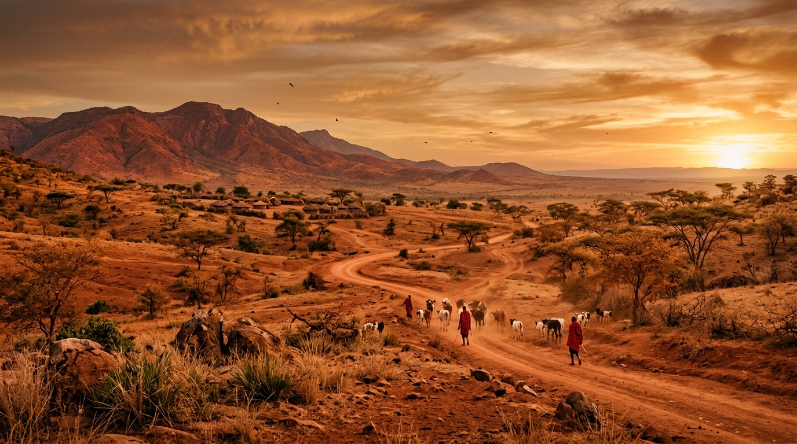
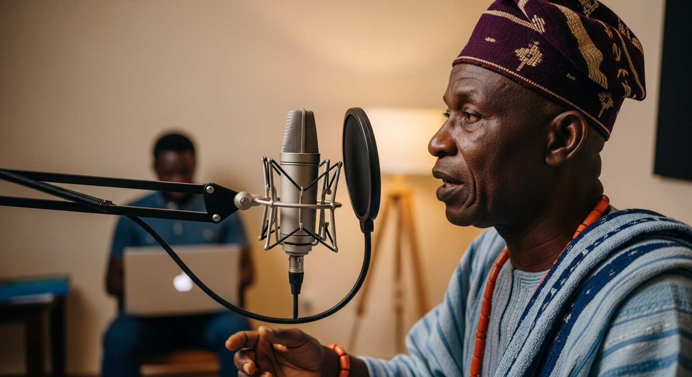

# AFRICORPUS Website — Customisation Guide

This document covers everything you need to know to update, customise, and maintain the AFRICORPUS website. No prior coding experience is required for most tasks. Each section tells you exactly where to look and what to change.

---

## Table of Contents

1. File Structure
2. How to Open and View the Site
3. Replacing Image Placeholders
4. Updating Team Photos
5. Editing Text Content
6. Colours — How to Change Them
7. Typography — Fonts Used
8. Adding or Removing Team Members
9. Adding or Removing Project Cards
10. Updating Contact Details
11. Updating Social Media Links
12. Going Live — Hosting Guidance
13. Image Recommendations

---

## 1. File Structure

```
africorpus-website.html     ← The entire website lives in this single file
AFRICORPUS-README.md        ← This guide
images/                     ← Create this folder and put all your photos here
  hero-photo.jpg
  about-photo.jpg
  john-eze.jpg
  chris-adeyemi.jpg
  team-amara.jpg
  team-fatima.jpg
  team-kwame.jpg
  team-zara.jpg
  team-david.jpg
  project-yoruba.jpg
  project-benin.jpg
  project-sahel.jpg
  project-afrispeech.jpg
  project-zimbabwe.jpg
  project-api.jpg
```

The website is a single HTML file. Everything — layout, styles, content, and behaviour — is contained within `africorpus-website.html`. You do not need separate CSS or JavaScript files.

---

## 2. How to Open and View the Site

Double-click `africorpus-website.html` to open it in any web browser (Chrome, Firefox, Safari, Edge). The fonts load from Google Fonts, so you need an internet connection to see them correctly.

To make it available online, see Section 12.

---

## 3. Replacing Image Placeholders

There are three image placeholder zones in the website. Each has a comment in the HTML that tells you exactly what to do.

### Hero Image (below the headline)

Find this comment in the HTML:
```html
<!-- CUSTOMISATION: Replace this entire div with an  tag pointing to your photography. -->
```

Replace the entire `<div class="hero-img-placeholder">...</div>` block with:
```html

```

**Recommended photo:** A wide, dark-toned image — a cultural ceremony, artifact being documented, an African landscape, or community gathering. Minimum size: **1400 × 480px**.

---

### About Section Image

Find this comment:
```html
<!-- CUSTOMISATION: Replace with  -->
```

Replace the `<div class="about-img-placeholder">...</div>` block with:
```html

```

**Recommended photo:** Founders working together, a field documentation session, or a community meeting. Minimum size: **800 × 340px**.

---

### Project Card Images

Each of the six project cards has a placeholder. Find:
```html
<div class="work-card-img">
  <!-- CUSTOMISATION: Replace with  -->
  <span class="work-card-img-label">Project Photo</span>
</div>
```

Replace the inner content with:
```html

```

Repeat for each of the six project cards with the appropriate image file and alt text. **Recommended size: 600 × 160px minimum.**

---

## 4. Updating Team Photos

All team photo placeholders show a coloured circle with initials. To replace with a real headshot:

### Co-Founder Photos (80px circles)

Find the placeholder:
```html
<div class="team-photo">JE</div>
```

Replace with:
```html
<div class="team-photo">
  
</div>
```

The CSS automatically crops it to a circle and sizes it correctly. **Recommended photo size: 200 × 200px minimum, square crop, face centred.**

### Team Member Photos (64px circles)

Find:
```html
<div class="team-photo-sm">AM</div>
```

Replace with:
```html
<div class="team-photo-sm">
  
</div>
```

Same guidance applies — square crop, face centred, minimum 150 × 150px.

---

## 5. Editing Text Content

All text content is written directly in the HTML. Use your browser's Find function (`Cmd+F` on Mac, `Ctrl+F` on Windows) to search for any phrase you want to change, then edit it in a text editor.

**Recommended free text editors:**
- **Visual Studio Code** (vscode.dev — works in browser)
- **Notepad++** (Windows)
- **TextEdit** (Mac — open as plain text)

### Key areas to update:

| What | Search for |
|------|-----------|
| Main headline | `The Digital` |
| Sub-headline | `Africa has over 2,000 languages` |
| Problem section text | `Every two weeks, a language dies` |
| Vision quote | `When AI doesn't know your language` |
| About section text | `AFRICORPUS was founded on` |
| Founding belief quote | `The soul of Africa is not in danger` |
| Co-founder bios | `John is a machine learning researcher` |
| Contact email | `hello@africorpus.org` |
| Copyright year | `© 2025 AFRICORPUS` |
| Footer tagline | `The soul of Africa lives on` |

---

## 6. Colours — How to Change Them

All colours are stored as CSS variables at the top of the `<style>` block. Search for `:root {` in the file to find them.

```css
:root {
  --obsidian:   #0E0C09;   /* Primary dark background */
  --burnt:      #8B3A1A;   /* Hover state for terracotta */
  --terra:      #C0502A;   /* Brand primary — buttons, accents */
  --ember:      #D4860B;   /* Warm amber accent */
  --gold:       #E6B44C;   /* Kente Gold — headlines, highlights */
  --sand:       #EDD9A3;   /* Light warm surface */
  --ash:        #BEB8A8;   /* Secondary text */
  --mist:       #F5F0E8;   /* Primary text on dark */
  --forest:     #2C4A2E;   /* Contextual green — ecological content */
  --warm-dark:  #1A1410;   /* Slightly lighter dark surface */
  --warm-panel: #221C17;   /* Card and panel backgrounds */
}
```

To change any colour, simply replace its hex value. For example, to make the primary button colour darker:
```css
--terra: #A03E1F;   /* Changed from #C0502A */
```

---

## 7. Typography — Fonts Used

The site uses three typefaces, all loaded from Google Fonts:

| Font | Role | Variable |
|------|------|----------|
| **Bricolage Grotesque** | All headlines, section titles, team names, nav, buttons | `--display` |
| **DM Sans** | Body copy, captions, labels, supporting text | `--sans` |
| **Cormorant Garamond** | Vision/manifesto quote only — one specific use | `--serif` |

The Google Fonts link is at the top of the file inside `<head>`:
```html
<link href="https://fonts.googleapis.com/css2?family=Bricolage+Grotesque:...&family=DM+Sans:...&family=Cormorant+Garamond:...&display=swap" rel="stylesheet">
```

**To change a font:** Replace the font name in both the Google Fonts URL and the corresponding CSS variable. Google Fonts (fonts.google.com) allows you to select fonts and copy a ready-made link tag.

---

## 8. Adding or Removing Team Members

### To add a team member

Copy one of the existing `.team-card-member` blocks and paste it inside the `<div class="team-members">` container:

```html
<div class="team-card-member fade-up">
  <div class="team-photo-sm">XX</div>   <!-- Replace XX with initials -->
  <div class="team-card-role">Role Title</div>
  <h3>Full Name</h3>
  <p>Short bio sentence here.</p>
</div>
```

The grid will automatically accommodate the new card.

### To remove a team member

Delete the entire `<div class="team-card-member">...</div>` block for that person.

### To change the grid columns

The team members currently display 4 per row on desktop. To change to 3 columns, find:
```css
.team-members { display:grid; grid-template-columns:repeat(4,1fr); ... }
```
Change `repeat(4,1fr)` to `repeat(3,1fr)`.

---

## 9. Adding or Removing Project Cards

### To add a project

Copy one of the existing `.work-card` blocks and paste it inside `<div class="work-grid">`. Update the image placeholder, status, title, description, tags, and meta line.

Status options:
- **Active** — use gold dot: `<span class="status-dot"></span>` with `style="color:var(--gold)"`
- **In Development** — use ember dot: `<span class="status-dot" style="background:var(--ember)">` with `style="color:var(--ember)"`
- **Upcoming** — use ash dot: `<span class="status-dot" style="background:var(--ash)">` with `style="color:var(--ash)"`
- **Completed** — use forest colour: `style="background:var(--forest)"` with `style="color:var(--forest)"`

### To remove a project

Delete the entire `<div class="work-card">...</div>` block for that project.

---

## 10. Updating Contact Details

The email address appears in three places. Search for `hello@africorpus.org` and replace all instances with your actual email.

The three locations are:
1. The "Get in Touch" section — the visible email link
2. The "Get in Touch" section — the button href
3. The footer — the Connect column link

If you want separate email addresses for different enquiries (e.g. grants vs general), you can update each location independently.

---

## 11. Updating Social Media Links

In the footer, find the "Follow" column:
```html
<div class="footer-col">
  <h4>Follow</h4>
  <ul>
    <li><a href="#">LinkedIn</a></li>
    <li><a href="#">Twitter / X</a></li>
    <li><a href="#">GitHub</a></li>
    <li><a href="#">Newsletter</a></li>
  </ul>
</div>
```

Replace each `#` with the full URL to your profile. For example:
```html
<li><a href="https://linkedin.com/company/africorpus">LinkedIn</a></li>
```

To remove a social link, delete the `<li>` line entirely.

---

## 12. Going Live — Hosting Guidance

The website is a single HTML file with no backend dependencies. It can be hosted on any static web host.

### Recommended free/affordable options:

**Netlify (Recommended — free tier)**
1. Go to netlify.com and create an account
2. Drag and drop your project folder (containing the HTML file and images folder) onto the Netlify dashboard
3. Your site is live instantly with a netlify.app URL
4. Connect a custom domain in Settings → Domain Management

**GitHub Pages (Free)**
1. Create a GitHub account and a new repository
2. Upload your files
3. Go to Settings → Pages → Source → main branch
4. Your site is live at username.github.io/repository-name

**Vercel (Free tier)**
Similar to Netlify — drag and drop or connect a GitHub repository.

### Custom domain

Once hosted, connect `africorpus.org` (or your chosen domain) by:
1. Purchasing the domain from a registrar (Namecheap, Cloudflare, Google Domains)
2. Following your host's domain connection guide — they will give you DNS records to add at your registrar

---

## 13. Image Recommendations

| Placement | Ideal dimensions | File format | Notes |
|-----------|-----------------|-------------|-------|
| Hero image | 1400 × 480px | JPG | Dark-toned, wide landscape or cultural scene |
| About image | 800 × 340px | JPG | Founders, field work, or community moment |
| Project cards | 600 × 160px | JPG | Representative of each project's subject matter |
| Team photos | 200 × 200px | JPG | Square crop, face centred, consistent lighting |

**File size:** Compress all images before uploading. Use squoosh.app (free, browser-based) to reduce file sizes without visible quality loss. Aim for under 200KB per image.

**Photography style:** The brand palette is warm, dark, and grounded. Photos should lean toward natural light, warm tones, and authentic moments — not staged corporate photography. Images of actual fieldwork, artifacts, communities, and cultural practice will serve the brand far better than stock photos.

---

## Questions

If anything in this guide is unclear, the HTML file itself contains inline comments (lines starting with `<!--`) at every point where customisation is needed. Search for `CUSTOMISATION:` in the file to find all placeholder locations quickly.

---

*AFRICORPUS Website — Version 1.0*
*Single-file HTML · Bricolage Grotesque + DM Sans · No dependencies*
